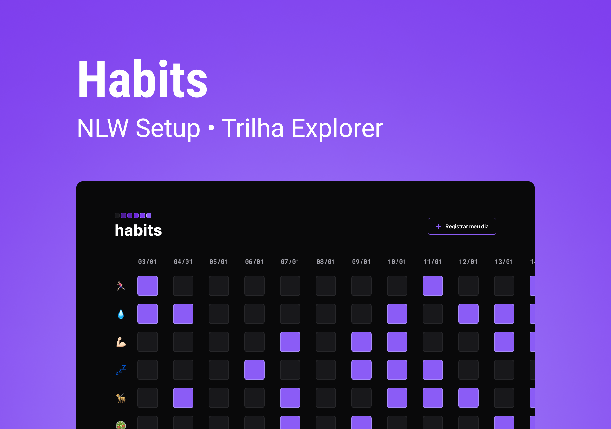

<h1 align="center"> Habits </h1>

  Projeto desenvolvido durante a NLW Setup, a primeira do ano de 2023, evento organizado pela <a href="https://www.rocketseat.com.br/">Rocketseat</a>.

  <a href="#-tecnologias">Tecnologias</a>&nbsp;&nbsp;&nbsp;|&nbsp;&nbsp;&nbsp;
  <a href="#-projeto">Projeto</a>&nbsp;&nbsp;&nbsp;|&nbsp;&nbsp;&nbsp;
  <a href="#-layout">Layout</a>&nbsp;&nbsp;&nbsp;|&nbsp;&nbsp;&nbsp;
  <a href="#-contribuição">Contribuição</a>&nbsp;&nbsp;&nbsp;|&nbsp;&nbsp;&nbsp;
  <a href="#memo-licença">Licença</a>

  

 

  

## 🚀 Tecnologias

Esse projeto foi desenvolvido com as seguintes tecnologias:

- JavaScript e JSON
- [Node e NPM](https://nodejs.org/)
- [Vite](https://vitejs.dev/)
- [React](https://reactjs.org/)
- Biblioteca NLWSetup

## 💻 Projeto

O Habits é um site onde você pode organizar seus hábitos diários, você vem clica no botão "Registrar o meu dia" e vai marcando os hábitos que você conseguiu, no dia seguinte você repete o processo, e o dia anterior ainda estará lá guardado no seu navegador.

[Veja o projeto online! ←](https://poveii-habits.netlify.app/)

## 🔖 Layout

Você pode visualizar o layout do projeto através [DESSE LINK](https://www.figma.com/community/file/1195327109778210238/duplicate). É necessário ter conta no [Figma](https://figma.com) para acessá-lo.

## 🫂 Contribuição

Você também pode contribuir com esse pequeno projeto, fazendo uma PR (Pull Request) com a adição de um novo habitEmoji 🤩. Obs.: Tem que ser um hábito comprovado que as pessoas querem fazer ou estejam fazendo.

→ [Em breve um passo a passo.](...)

## :memo: Licença

Esse projeto está sob a licença MIT.

---

Feito com ❤️ by Poveii
